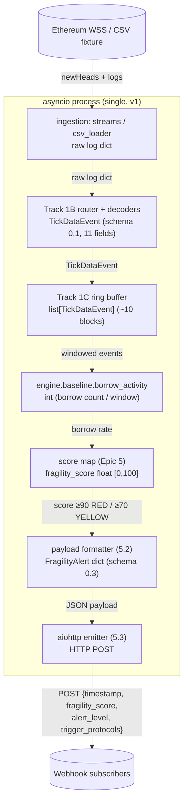

# Story 4R.4 — System Data-Flow Diagram `[RESEARCH]`

Date: 2026-08-06 · Refs: `research/decision_b0_v1_detector.md`, `research/latency_budget.md`

End-to-end data flow for the **v1 (B0)** pipeline, with the data type at every
boundary. Unlike the original MPS design, v1 runs **single-process async** — there
is no separate engine process (NFR3 was motivated by the CPU-bound MPS core, which
is parked; see the decision record).

## v1 (B0) flow

## Boundary data contracts

| Edge | Type | Contract |
|---|---|---|
| WSS → ingest | raw log / block header | web3 `AttributeDict` / CSV row |
| decode → buffer | `TickDataEvent` | `contracts/tick_data.schema.json` (11 fields) |
| buffer → B0 | `list[TickDataEvent]` | last ~10 blocks (NFR4) |
| B0 → score | `int` (borrow count) | `engine.baseline.borrow_activity` |
| score → payload | `float` `fragility_score` ∈ [0,100] | `calibration/luna_calibration.md` mapping |
| payload → emitter | `FragilityAlert` | `contracts/fragility_alert.schema.json` (timestamp, fragility_score, alert_level, trigger_protocols) |
| emitter → subscriber | HTTP POST JSON | webhook body = FragilityAlert |

## Parked MPS path (for reference)

If MPS is ever un-parked, insert between "ring buffer" and "detector":
`build_graph → GraphSnapshot → adjacency_tensor + feature_tensor → normalize(minmax)
→ fragility_raw → score`, and move that block to a **separate process** (NFR3) with
SharedMemory/Queue IPC (4R.2) — none of which v1 needs.
