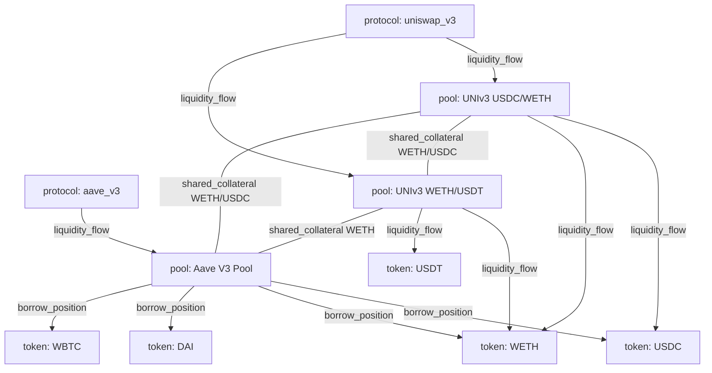

# Story 2R.2: Graph Topology Design

## Purpose

This report locks how the QuantumRadar DeFi **state graph** is constructed:
node types, edge-formation rules, expected runtime node count `N`, and adjacency
sparsity. It determines the tensor shapes for Track 2B — adjacency `(N, N)`
(Story 2B.1) and node features `(N, F)` (Story 2B.2) — and decides whether the
sparse variant (Story 2B.4) is needed for v1.

Research-only artifact. No code or schema changes; any contract change is a
recommendation only.

References:
- Node/edge enums (locked): `contracts/graph_snapshot.schema.json`
- Scope (whitelist): `ingestion/whitelist.yaml`, Story 1B.3 / E.2
- Feature link: Story 2R.1 (`connectivity` = degree-based, must match edge rules here)
- Consumers: 2B.1 `(N,N)`, 2B.2 `(N,F)`, 2B.4 sparse decision, 2A.2/2A.3 builder

---

## 1. Nodes from the Whitelist (AC1, AC3)

Actual whitelist scope (`ingestion/whitelist.yaml`):

| Contract | Protocol | Tokens |
|---|---|---|
| `0x88e6…5640` | uniswap_v3 | USDC / WETH |
| `0x4e68…fa36` | uniswap_v3 | WETH / USDT |
| `0x87870b…4E2` | aave_v3 | multi-reserve (extracted from topics) |
| `0x7d2768…c7A9` | aave_v3 alias (Aave V2, **backtest only**) | multi-reserve |

Mapped to the three locked node types (`protocol`, `pool`, `token`):

**Protocol nodes (2):** `uniswap_v3`, `aave_v3`
**Pool nodes (3 realtime + 1 backtest):**
- `P1` = UNIv3 USDC/WETH (`0x88e6…5640`)
- `P2` = UNIv3 WETH/USDT (`0x4e68…fa36`)
- `P3` = Aave V3 Pool (`0x87870b…4E2`)
- `P4` = Aave V2 Pool (`0x7d2768…c7A9`) — backtest LUNA/FTX only

**Token nodes:**
- Realtime core: `WETH`, `USDC`, `USDT` (from DEX pools) + Aave reserves
  `DAI`, `WBTC` → 5 tokens
- Backtest adds volatile reserves `LUNA`, `UST` → 7 tokens

### N estimate

| Scenario | protocol | pool | token | **N** |
|---|---:|---:|---:|---:|
| Realtime v1 | 2 | 3 | 5 | **~10** |
| Realtime + backtest | 2 | 4 | 7 | **~13** |
| Headroom (more reserves) | 2 | 5 | ~8 | **~15** |

**N ≈ 10–15 for v1.** (This refines the story's earlier 15–25 guess downward —
the concrete whitelist yields a smaller graph because WETH/USDC are shared.)

---

## 2. Node & Edge Rules (AC2)

Uses **exactly** the locked contract enums — no new node/edge types invented.

- Node types: `protocol`, `pool`, `token`
- Edge types: `liquidity_flow`, `borrow_position`, `shared_collateral`
- Edge `weight ∈ [0,1]` (normalization is Story 2A.4's job; here we define *when*
  an edge exists, not the exact weight formula).

### Edge-formation rules

| Edge type | Connects | Rule (when created) | Weight source (hint for 2A.4) |
|---|---|---|---|
| `liquidity_flow` | pool → token, **and** protocol → pool | A pool routes/holds a token (Uniswap pool → its token0/token1). A protocol aggregates its pools (protocol → each of its pools). Derived from swap/mint/burn events touching `pool_address`, `token0/1`. | normalized swap/liquidity volume share |
| `borrow_position` | pool(Aave) → token(reserve) | Aave lending pool has an active borrow/collateral relationship with a reserve token. Derived from `borrow`/`supply`/`withdraw`/`liquidation` events (reserve = token0, collateral/debt from topics). | normalized borrow amount / utilization |
| `shared_collateral` | pool ↔ pool | Two pools share a common token (e.g. WETH in both a Uniswap pool and the Aave pool). This is the **contagion channel**: stress in a shared asset propagates across pools. | normalized shared-token exposure |

Directionality: `graph_snapshot.schema.json` edges carry `src`/`dst`.
`liquidity_flow` / `borrow_position` are naturally directed (pool→token,
pool→reserve); `shared_collateral` is symmetric (emitted once per pool-pair, or
both directions). For the **adjacency tensor** (2B.1), symmetrize unless 2B.1
explicitly wants a directed matrix.

### Sample graph (realtime v1, N=10)

---

## 3. Sparsity Estimate (AC3)

Edge count for the sample realtime graph (N=10):

| Edge type | Count |
|---|---:|
| `liquidity_flow` protocol→pool | 3 |
| `liquidity_flow` pool→token | 4 |
| `borrow_position` (Aave→reserves) | 4 |
| `shared_collateral` (pool-pairs) | 3 |
| **Total edges E** | **14** |

Adjacency `N×N = 10×10 = 100` cells.

- **Symmetrized** (each undirected edge → 2 cells, zero diagonal):
  nonzero = `2 × 14 = 28` → **density ≈ 28%, sparsity ≈ 72%**.
- **Directed** (one cell per edge): nonzero = `14` → **density 14%, sparsity 86%**.

Backtest graph (N=13, +P4 Aave V2, +LUNA/UST, E≈20): `169` cells,
symmetrized nonzero ≈ `40` → density ≈ 24%, sparsity ≈ 76%.

**Takeaway:** density lands in the **~15–30%** band (sparsity ~70–85%) at v1
scale. This is *moderately* sparse — but at N≈10–15 the absolute matrix is tiny.

### Memory / compute footprint (dense)

| N | cells (N²) | dense bytes (float32) |
|---:|---:|---:|
| 15 | 225 | 900 B |
| 50 | 2,500 | 10 KB |
| 128 | 16,384 | 64 KB |
| 512 | 262,144 | **1 MB** |

At v1 (N≤15) the dense adjacency is **<1 KB** — sparse-tensor index overhead
(COO/CSR bookkeeping) would cost *more* than it saves.

---

## Decision

**v1 uses a DENSE adjacency tensor `(N, N)` and dense feature tensor `(N, F=5)`.**

- **N ≈ 10–15** for the current whitelist (realtime ~10, +backtest ~13).
- Dense is the right call: matrix is <1 KB, torch-native, no sparse-op overhead,
  and MPS contraction at this size is negligible. Density (~15–30%) is not sparse
  *enough* to benefit from sparse formats at small N.
- **Story 2B.4 (sparse variant) is NOT required for v1 — defer / mark optional.**

### Threshold to switch to sparse (2B.4 trigger)

Adopt sparse when **both** hold (memory + compute grow O(N²)):

1. **N ≥ 128** (evaluate) → **N ≥ 512** (mandate), i.e. dense adjacency ≳ 1 MB, **and**
2. **sparsity ≥ 90%** (density ≤ 10%) — below this, dense stays competitive.

Concrete rule of thumb for 2B.1/2B.4:
- `N < 128`: always dense (v1 lives here).
- `128 ≤ N < 512`: dense unless profiling (per Story 4R.1 latency budget) shows adjacency ops are a bottleneck **and** sparsity ≥ 90%.
- `N ≥ 512`: switch to sparse `(N,N)` (COO/CSR) — build 2B.4.

### Cross-story notes

- **2R.1 `connectivity`:** define as `connectivity(node) = degree(node) / (N − 1)`
  using the **undirected** incident-edge count under the rules above (∈ [0,1],
  matching the schema `connectivity max:1`). Keep this identical in 2B.2.
- **2B.1/2B.2:** tensor shapes `(N,N)` and `(N,5)`; N is dynamic per snapshot —
  do not hard-code, read from the node list.
- **Contract:** no new node/edge types needed; scope fits the 3 locked node
  types and 3 locked edge types. No `$id` bump required.
